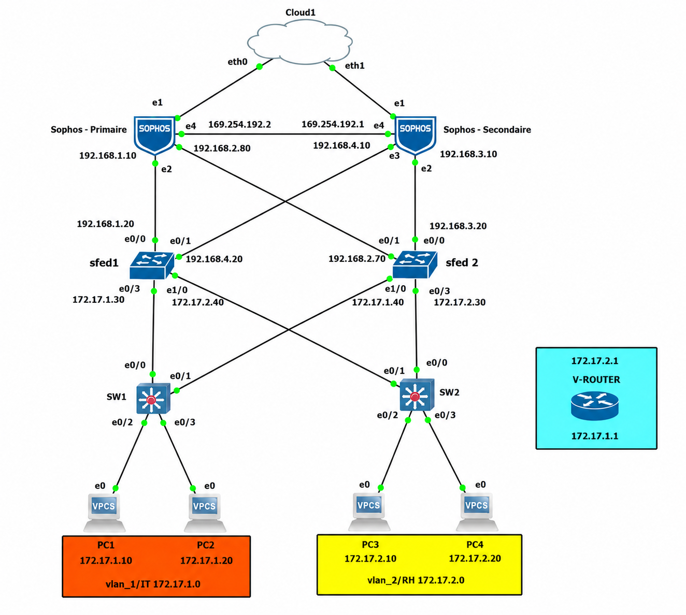

<h1 align="center">High Availability Network Infrastructure (Sophos & Cisco)</h1>

  
  
  
  

---

## 📌 Project Overview

In critical enterprise environments, continuous service availability is a top priority. This project focuses on the design, simulation, and configuration of a highly available (HA) and secure network infrastructure. 

Built within a simulated **GNS3** and **VMware** environment, the architecture utilizes a **Sophos XG Firewall Active-Passive cluster** combined with Cisco Layer 2 and Layer 3 redundancy protocols. The primary objective is to guarantee uninterrupted service continuity and zero-downtime failover in the event of hardware, software, or link failures.

**📄 Full Documentation:** [Download the comprehensive Project Report (PDF)](./Rapport_SophosFirewall.pdf) 

---

## 🏗️ Architecture & Topology

The network is segmented to separate departmental traffic while ensuring high availability at both the routing (L3) and switching (L2) layers.

* **Network Segmentation:**
    * **VLAN 10 (IT Dept):** `192.168.1.0/24`
    * **VLAN 20 (HR Dept):** `192.168.2.0/24`
* **Access Layer (L2):** Cisco IOU L2 switches (`SW1`, `SW2`) handling endpoint connectivity and VLAN assignment.
* **Distribution/Core Layer (L3):** Cisco IOU L3 switches (`sFed1`, `sFed2`) handling inter-VLAN routing and gateway redundancy.
* **Security Perimeter:** Dual Sophos XG Firewalls configured in a high-availability cluster, managing traffic filtering, NAT, and secure external access.

---

## ⚙️ Core Technologies & Protocols Implemented

### 1. Gateway Redundancy (HSRP)
Implemented **Hot Standby Router Protocol (HSRP)** on the L3 core switches to provide a single virtual gateway (`172.17.1.100` and `172.17.2.1`) for the internal VLANs. 
* Configured Active/Standby states with preemptive failover enabled.
* Priority weighting (Priority `105` for active nodes) to control the active routing path.

### 2. Dynamic Routing (OSPF)
Deployed **Open Shortest Path First (OSPF)** across the Layer 3 infrastructure to ensure fast convergence.
* Configured a single-area (Area 0) OSPF setup for dynamic route propagation between the core switches and the firewall gateway.
* Minimizes routing loops and adapts immediately to link state changes.

### 3. Layer 2 Loop Prevention (STP)
Utilized **Spanning Tree Protocol (STP)** on the L2 access switches to prevent broadcast storms while maintaining standby redundant physical links to the L3 core.

### 4. Firewall High Availability (Sophos QuickHA)
Configured a **Sophos XG Active-Passive HA Cluster** using the Interactive QuickHA mode.
* **Heartbeat Link:** Dedicated DMZ physical interface (Port E) for continuous state synchronization.
* **Failover Mechanism:** Real-time stateful synchronization ensures the passive firewall instantly assumes control of the primary IP address and MAC routing tables if the active firewall drops the heartbeat signal (configured at 250ms intervals).

---

## 🚀 Implementation Highlights

1.  **VLAN & Trunking:** Provisioned VLANs 10 and 20, assigned access ports, and established 802.1Q trunks between L2 and L3 switches.
2.  **L3 Routing Configuration:** Assigned IP addresses to interface ranges and validated OSPF neighbor adjacencies.
3.  **Sophos Initial Setup:** Registered appliances, configured LAN/WAN interfaces, and enabled necessary administrative services (SSH, HTTPS) on the DMZ zone.
4.  **Cluster Synchronization:** Established the HA link using a secure passphrase, verified the Active/Passive roles in the Sophos GUI, and confirmed configuration mirroring.
5.  **Disaster Recovery Testing:** Simulated active node and link failures within GNS3 to validate automatic HSRP and Sophos failover mechanisms, achieving near-zero packet loss during transition.

---

## 💡 Key Takeaways

This project demonstrates practical expertise in:
* Designing fault-tolerant, N-Tier network architectures.
* Configuring and troubleshooting Cisco routing and switching protocols (HSRP, OSPF, STP).
* Deploying Enterprise Next-Generation Firewalls (NGFW) in mission-critical HA clusters.
* Translating business continuity requirements into technical routing parameters.
